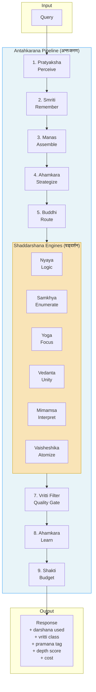

# Darshana Architecture Diagram

## The Cognitive Operating System Drawn from Hindu Philosophy

This document maps the complete Darshana architecture — a reasoning system that encodes 5,000 years of Hindu philosophical inquiry as computational principles.

---

## High-Level Pipeline: The Antahkarana (अन्तःकरण — Inner Instrument)

```
┌─────────────────────────────────────────────────────────────────────────────────┐
│                        ANTAHKARANA PIPELINE (9 Steps)                           │
│                                                                                 │
│   ┌──────────┐   ┌──────────┐   ┌──────────┐   ┌──────────┐   ┌────────────┐  │
│   │    1.     │   │    2.     │   │    3.     │   │    4.     │   │     5.      │  │
│   │PRATYAKSHA │──▶│  SMRITI   │──▶│  MANAS   │──▶│ AHAMKARA │──▶│   BUDDHI    │  │
│   │ Perceive  │   │ Remember  │   │ Assemble │   │Strategize│   │   Route     │  │
│   │ (प्रत्यक्ष)│   │ (स्मृति)  │   │ (मनस्)   │   │ (अहंकार) │   │  (बुद्धि)   │  │
│   └──────────┘   └──────────┘   └──────────┘   └──────────┘   └─────┬──────┘  │
│                                                                       │         │
│                                                                       ▼         │
│                                                          ┌────────────────────┐ │
│                                                          │  6. DARSHANA       │ │
│                                                          │  ENGINES           │ │
│                                                          │  (षड्दर्शन)        │ │
│                                                          │  [See Below]       │ │
│                                                          └────────┬───────────┘ │
│                                                                   │             │
│   ┌──────────┐   ┌──────────┐   ┌──────────┐                     │             │
│   │    9.     │   │    8.     │   │    7.     │                     │             │
│   │  SHAKTI   │◀──│ AHAMKARA │◀──│  VRITTI   │◀────────────────────┘             │
│   │  Budget   │   │  Learn   │   │  Filter   │                                  │
│   │ (शक्ति)   │   │ (अहंकार) │   │ (वृत्ति)  │                                  │
│   └────┬─────┘   └──────────┘   └──────────┘                                   │
│        │                                                                        │
│        ▼                                                                        │
│   ┌──────────┐                                                                  │
│   │ RESPONSE │                                                                  │
│   └──────────┘                                                                  │
└─────────────────────────────────────────────────────────────────────────────────┘
```

---

## The Six Darshana Engines (षड्दर्शन — Six Visions)

```
                          ┌───────────────────┐
                          │   BUDDHI (Router)  │
                          │   Selects 1-6      │
                          │   engines based on  │
                          │   query analysis    │
                          └─────────┬─────────┘
                                    │
              ┌─────────┬───────────┼───────────┬──────────┬──────────┐
              ▼         ▼           ▼           ▼          ▼          ▼
     ┌──────────┐ ┌──────────┐ ┌──────────┐ ┌──────────┐ ┌────────┐ ┌──────────┐
     │  NYAYA   │ │ SAMKHYA  │ │   YOGA   │ │ VEDANTA  │ │MIMAMSA │ │VAISHESHIKA│
     │  न्याय    │ │  सांख्य   │ │   योग    │ │  वेदान्त  │ │ मीमांसा │ │ वैशेषिक  │
     │          │ │          │ │          │ │          │ │        │ │          │
     │  LOGIC   │ │ENUMERATE │ │  FOCUS   │ │  UNITY   │ │INTERPRET│ │ ATOMISM  │
     │          │ │          │ │          │ │          │ │        │ │          │
     │ Proof &  │ │ Classify │ │ Signal / │ │Reconcile │ │ Text → │ │Irreducible│
     │ Validity │ │ & Map    │ │  Noise   │ │Opposites │ │ Action │ │Components│
     └──────────┘ └──────────┘ └──────────┘ └──────────┘ └────────┘ └──────────┘

     5-member      15+ part      Pratyahara   Neti Neti    Vidhi       6 Padartha
     syllogism     decomposition + Dharana    + Mahavakya  extraction  classification
     + 5 fallacy   + causal       + scoring   + Adhyaropa  + sentence  + recursive
     audit         chains                     /Apavada     typing     decomposition
```

---

## Yaksha Protocol (Multi-Darshana Parallel Reasoning)

```
                    ┌─────────────────────┐
                    │    YAKSHA PROTOCOL   │
                    │    (यक्ष प्रश्न)      │
                    │  "The Yaksha's       │
                    │   Question"          │
                    └──────────┬──────────┘
                               │
            ┌──────────────────┼──────────────────┐
            ▼                  ▼                  ▼
    ┌───────────────┐ ┌───────────────┐ ┌───────────────┐
    │   PARALLEL    │ │   PARALLEL    │ │   PARALLEL    │
    │   ENGINE 1    │ │   ENGINE 2    │ │   ENGINE N    │
    │   (any of 6)  │ │   (any of 6)  │ │   (any of 6)  │
    └───────┬───────┘ └───────┬───────┘ └───────┬───────┘
            │                 │                  │
            └─────────────────┼──────────────────┘
                              ▼
                    ┌─────────────────────┐
                    │  VEDANTA SYNTHESIS   │
                    │  Consensus +         │
                    │  Tensions +          │
                    │  Action Items        │
                    └─────────────────────┘
```

---

## The Four Logical Layers

```
┌─────────────────────────────────────────────────────────────────────┐
│                                                                     │
│  LAYER 1: BUDDHI — Fast Discrimination                             │
│  ┌────────────────┐  ┌────────────────┐  ┌────────────────┐       │
│  │ PRAMANA TAG    │  │  GUNA SELECT   │  │ DARSHANA ROUTE │       │
│  │                │  │                │  │                │       │
│  │ pratyaksha     │  │ sattva =       │  │ keyword match  │       │
│  │ (observation)  │  │  precision     │  │ → engine       │       │
│  │ anumana        │  │ rajas =        │  │  scores        │       │
│  │ (inference)    │  │  exploration   │  │ → top-N        │       │
│  │ upamana        │  │ tamas =        │  │  activation    │       │
│  │ (analogy)      │  │  retrieval     │  │                │       │
│  │ shabda         │  │                │  │                │       │
│  │ (testimony)    │  │                │  │                │       │
│  └────────────────┘  └────────────────┘  └────────────────┘       │
│                                                                     │
├─────────────────────────────────────────────────────────────────────┤
│                                                                     │
│  LAYER 2: SHADDARSHANA — Six Specialized Reasoning Engines         │
│  ┌─────┐ ┌────────┐ ┌──────┐ ┌────────┐ ┌───────┐ ┌───────────┐  │
│  │Nyaya│ │Samkhya │ │ Yoga │ │Vedanta │ │Mimamsa│ │Vaisheshika│  │
│  │Logic│ │Classify│ │Focus │ │ Unity  │ │Action │ │  Atoms    │  │
│  └─────┘ └────────┘ └──────┘ └────────┘ └───────┘ └───────────┘  │
│                                                                     │
├─────────────────────────────────────────────────────────────────────┤
│                                                                     │
│  LAYER 3: VRITTI FILTER — Pre-Output Quality Gate                  │
│  ┌───────────────────────────────────────────────────────────┐     │
│  │                                                           │     │
│  │  ┌─────────┐  ┌──────────┐  ┌────────┐  ┌─────┐ ┌─────┐│     │
│  │  │ PRAMANA │  │VIPARYAYA │  │VIKALPA │  │NIDRA│ │SMRITI││     │
│  │  │ Valid   │  │  Error   │  │Verbal  │  │ No  │ │Pure  ││     │
│  │  │Cognition│  │Misconception│Delusion│  │Know │ │Recall││     │
│  │  │   ✅    │  │   ❌→fix  │  │  🚫    │  │  🤷  │ │ 📋  ││     │
│  │  │ OUTPUT  │  │ CORRECT  │  │ BLOCK  │  │ADMIT│ │ FLAG ││     │
│  │  └─────────┘  └──────────┘  └────────┘  └─────┘ └─────┘│     │
│  │                                                           │     │
│  │  + MayaLayer (tracks representation gaps)                 │     │
│  │  + KarmaStore (runtime learning cycles)                   │     │
│  └───────────────────────────────────────────────────────────┘     │
│                                                                     │
├─────────────────────────────────────────────────────────────────────┤
│                                                                     │
│  LAYER 4: INFRASTRUCTURE — Self-Model & Utilities                  │
│  ┌──────────┐ ┌───────┐ ┌───────────┐ ┌───────┐ ┌───────┐        │
│  │ AHAMKARA │ │SMRITI │ │PRATYAKSHA │ │ MANAS │ │SHAKTI │        │
│  │Self-Model│ │Memory │ │Perception │ │Attend │ │Budget │        │
│  │ Intro-   │ │SQLite │ │ 5-Channel │ │ 3-Mode│ │Compute│        │
│  │ spection │ │+Decay │ │  Input    │ │Context│ │Alloc  │        │
│  └──────────┘ └───────┘ └───────────┘ └───────┘ └───────┘        │
│                                                                     │
└─────────────────────────────────────────────────────────────────────┘
```

---

## Deployment Architecture

```
┌─────────────────────────────────────────────────────────────────────┐
│                        DARSHANA SYSTEM                              │
│                                                                     │
│  ┌───────────────────────────────────────────────────────────┐     │
│  │                    INTERFACES                              │     │
│  │                                                           │     │
│  │  ┌─────────────┐  ┌──────────────┐  ┌──────────────────┐ │     │
│  │  │   CLI REPL   │  │ CLAUDE CODE  │  │    MCP SERVER    │ │     │
│  │  │ python -m    │  │   PLUGIN     │  │    9 tools       │ │     │
│  │  │  darshana    │  │  10 skills   │  │ Any MCP client   │ │     │
│  │  └──────┬──────┘  └──────┬───────┘  └────────┬─────────┘ │     │
│  │         │                │                    │           │     │
│  └─────────┼────────────────┼────────────────────┼───────────┘     │
│            └────────────────┼────────────────────┘                  │
│                             ▼                                       │
│  ┌───────────────────────────────────────────────────────────┐     │
│  │              ANTAHKARANA CORE (src/)                       │     │
│  │              16 Python modules                            │     │
│  │              from darshana import Antahkarana              │     │
│  └───────────────────────────┬───────────────────────────────┘     │
│                               │                                     │
│  ┌───────────────────────────┼───────────────────────────────┐     │
│  │              LLM BACKEND                                   │     │
│  │                                                           │     │
│  │  ┌─────────────────┐       ┌────────────────────────┐     │     │
│  │  │ Anthropic Claude│       │  Kimi K2.5 (1T MoE)   │     │     │
│  │  │   (API)         │       │  + 8 LoRA adapters     │     │     │
│  │  │                 │       │  (self-hosted on       │     │     │
│  │  │                 │       │   p4d.24xlarge)        │     │     │
│  │  └─────────────────┘       └────────────────────────┘     │     │
│  │                                                           │     │
│  └───────────────────────────────────────────────────────────┘     │
│                                                                     │
│  ┌───────────────────────────────────────────────────────────┐     │
│  │              TRAINING PIPELINE (training/)                 │     │
│  │                                                           │     │
│  │  1,790 examples → LoRA fine-tune → 8 adapters            │     │
│  │  (6 darshana + router + vritti classifier)                │     │
│  │  + Vritti reward model for RLHF                           │     │
│  │                                                           │     │
│  └───────────────────────────────────────────────────────────┘     │
│                                                                     │
└─────────────────────────────────────────────────────────────────────┘
```

---

## The Kimi K2.5 MoE Parallel

```
┌────────────────────────────┐    ┌────────────────────────────┐
│   DARSHANA ARCHITECTURE    │    │      KIMI K2.5 MoE         │
│                            │    │                            │
│  6 darshana engines        │◄──►│  384 experts per layer     │
│  (specialized reasoners)   │    │  (specialized parameters)  │
│                            │    │                            │
│  Buddhi router selects     │◄──►│  Top-8 routing selects     │
│  engines before compute    │    │  experts before compute    │
│                            │    │                            │
│  Shared substrate          │◄──►│  Shared expert             │
│  (universal reasoning)     │    │  (always active)           │
│                            │    │                            │
│  LoRA = specialization     │◄──►│  Expert = specialization   │
│  (composable modules)      │    │  (composable modules)      │
│                            │    │                            │
│  Yoga: direct attention,   │◄──►│  Fine-tune only attention  │
│  not accumulate data       │    │  layers, freeze experts    │
└────────────────────────────┘    └────────────────────────────┘

     The same architecture, discovered independently 5,000 years apart.
```

---

## Philosophical Mapping: Sanskrit → Code

```
┌──────────────────────────────────────────────────────────────────┐
│              SANSKRIT CONCEPT → CODE MODULE                      │
│                                                                  │
│  अन्तःकरण  Antahkarana  (inner instrument)  →  antahkarana.py   │
│  बुद्धि     Buddhi       (discrimination)    →  darshana_router  │
│  मनस्       Manas        (mind/attention)     →  manas.py        │
│  अहंकार    Ahamkara     (self-sense)         →  ahamkara.py     │
│  वृत्ति     Vritti       (mental waves)       →  vritti_filter   │
│  स्मृति     Smriti       (memory)             →  smriti.py       │
│  प्रत्यक्ष  Pratyaksha   (perception)         →  pratyaksha.py   │
│  शक्ति     Shakti       (energy/power)       →  shakti.py       │
│  यक्ष       Yaksha       (divine question)    →  yaksha.py       │
│  प्रमाण    Pramana      (means of knowing)   →  enum in router  │
│  गुण        Guna         (quality/mode)       →  enum in router  │
│  माया       Maya         (representation gap) →  MayaLayer class │
│  कर्म       Karma        (action/consequence) →  KarmaStore class│
│  संस्कार   Samskara     (deep impressions)   →  smriti records  │
│  वासना     Vasana       (latent tendencies)  →  ahamkara biases │
│  दर्शन     Darshana     (vision/viewpoint)   →  6 engine prompts│
│                                                                  │
└──────────────────────────────────────────────────────────────────┘
```

---

## The 7 Operating Principles in the Architecture

```
  ┌─────────────────────────────────────────────────────────────┐
  │                  7 OPERATING PRINCIPLES                     │
  │                                                             │
  │  1. Reality is layered     →  4-layer architecture          │
  │     (Samkhya tattvas)         (Buddhi → Engines → Vritti    │
  │                                → Infrastructure)            │
  │                                                             │
  │  2. Multiple perspectives  →  6 darshana engines +          │
  │     coexist                   Yaksha Protocol                │
  │                                                             │
  │  3. You are not your       →  Vritti Filter separates       │
  │     thoughts                  valid cognition from noise    │
  │                                                             │
  │  4. Act fully, cling to    →  Nishkama karma: best output,  │
  │     nothing                   no attachment to being right  │
  │                                                             │
  │  5. Everything exists in   →  Pramana tagging: every claim  │
  │     relationship              linked to its source          │
  │                                                             │
  │  6. Knowledge has levels   →  Guna modes: sattva (deep),    │
  │                               rajas (explore), tamas (quick)│
  │                                                             │
  │  7. Patterns repeat at     →  Same architecture at code,    │
  │     different scales          plugin, MCP, and training     │
  │                               levels                        │
  └─────────────────────────────────────────────────────────────┘
```

---

## Mermaid Diagram (for rendering tools)



---

*This architecture was built by 25 parallel agents with no shared context — coherent through shared protocol. Like the Vedic shakhas: distributed preservation through shared structure.*
